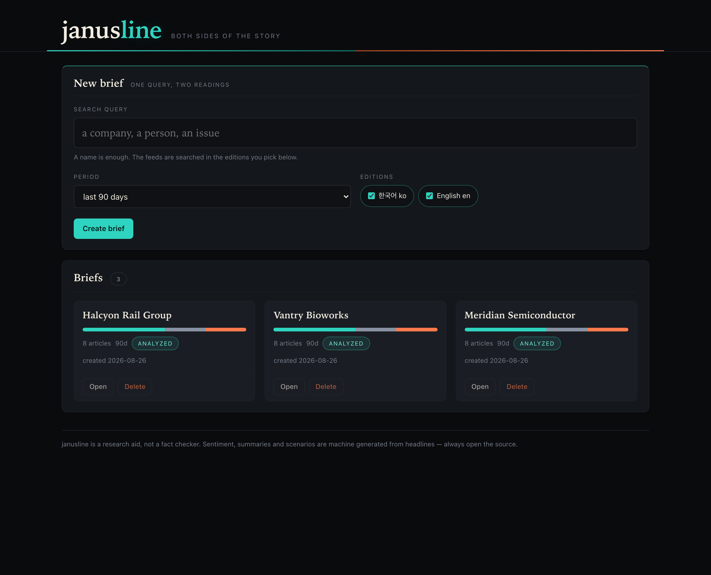
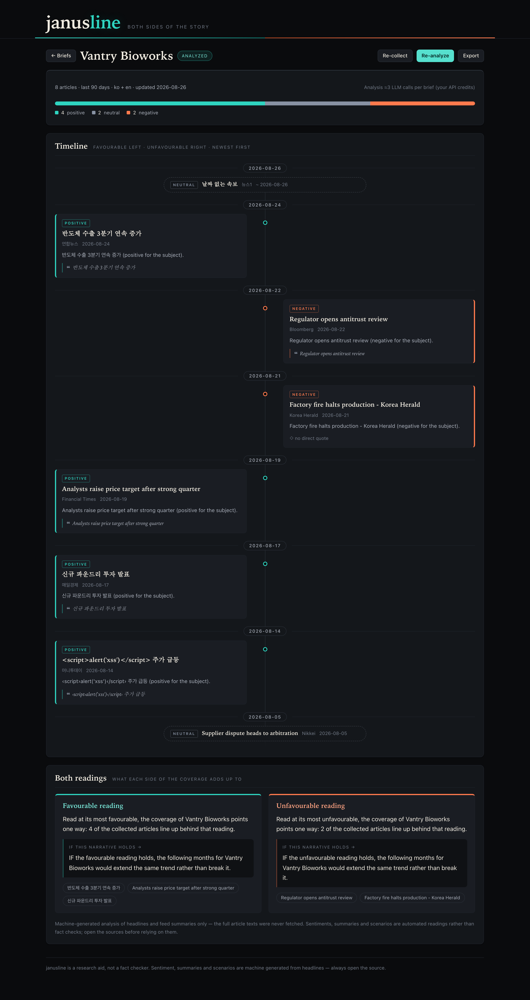

# janusline

[](https://github.com/oh-namgyu/janusline/actions/workflows/ci.yml)

> **한글 요약** — 검색어 하나로 뉴스 양면 브리핑을 만듭니다 — 세로 타임라인의 왼쪽엔 긍정, 오른쪽엔 부정 기사를 시간순으로 배치하고, 하단에 양측 서사 종합과 IF 시나리오(근거 기사 인용 포함)를 대비해 보여줍니다. Google News RSS 무키 수집, 셀프호스트. *(전체 한국어 문서: [README_KOR.md](README_KOR.md))*

A self-hosted **dual-sided news briefing** tool. Type one search query — a
company, a person, an issue — and janusline collects the news around it and lays
it out on a single vertical timeline: **favourable coverage down the left,
unfavourable down the right**, in chronological order, with neutral items on the
centre rail. Underneath, it writes the **two opposing readings** of the same
material side by side, each with an explicit *IF this reading is right* scenario
and citations back to the articles it rests on.

The point is not to tell you who is right. It is to stop you reading only one
side of a story because that is the side the feed handed you.

Everything lives in plain files on your own machine. One optional API key, no
database, no accounts, no build step.

*(README_KOR.md — [한국어 문서](README_KOR.md))*

## Disclaimer — read this first

**janusline is a research aid, not a fact checker.**

- **The analysis is machine generated.** Sentiment labels, one-line summaries,
  both narratives and both IF scenarios are written by a language model. They are
  automated readings, not verified findings, and they can be wrong.
- **It reads headlines, not articles.** Only the RSS title and the feed snippet
  are ever fetched. Full article texts are never retrieved, so every judgement is
  made from a headline and a sentence or two — a classification can invert once
  you open the piece.
- **"Positive" and "negative" mean *for the subject you searched*,** not the tone
  of the writing. A neutrally worded recall notice is negative; a rival's setback
  is positive. That is a deliberate definition, and it is a judgement call the
  model can get wrong.
- **Open the sources.** Every card links to the original. The app says this on
  every brief, the exported file repeats it in its footer, and neither of those
  strings can be rewritten by the model — the server owns them.
- **Do not use it as evidence** about a person or a company. Searching a named
  individual and treating the right-hand column as fact is exactly the misuse
  this section exists to warn against.

## How it works

```
search query
      │
      ▼
  Collect ──► articles                        (0 API calls — public Google News RSS)
      │        Korean + English editions, deduped, period filtered, ≤40 kept
      ▼
  Analyze ──► sentiment · summary · evidence   (⌈n/25⌉ classification calls)
      │    ──► two readings + IF scenarios     (+ 1 synthesis call)
      ▼
  Read ──► dual timeline + the two readings   (0 — plain file reads)
      │
      ▼
  Export ──► one standalone HTML file, no scripts, no external references
```

Collection and analysis are separate buttons on purpose. Collecting is free, so
you can see what the query actually returns — and decide the query is wrong —
before spending anything on analysing it.

Two grounding rules keep the output tied to its sources. An `evidence` quote is
kept only if it is a **verbatim substring** of that article's own title or
snippet; anything paraphrased is demoted to *no direct quote* while the
classification stands. A reading's `citations` must be **ids of articles actually
sent**; if a side ends up citing nothing, the UI marks it *insufficient
citations* rather than presenting it as supported.

## Screenshots

**Home** — one query in, a list of briefs out, each with its own positive/negative ratio bar.



**Brief** — the dual timeline down the middle, favourable left, unfavourable right, the two readings below.



## Quickstart

### Local (venv)

```bash
python -m venv .venv && source .venv/bin/activate
pip install -r requirements.txt
export ANTHROPIC_API_KEY=sk-ant-...      # optional — analysis only
python app.py
```

Open <http://127.0.0.1:6181>. The JSON API lives under `/api`.

**Without a key it still runs.** Creating briefs, collecting news, browsing the
timeline and exporting all work with no key at all — only *Analyze* needs one,
and without it that one call returns `503`. Google News RSS is a public feed.

Want the whole thing offline, including the analysis? `JANUSLINE_FAKE=1 python app.py`
swaps in fixture feeds and an offline analyst — no keys, no network, no cost.

### Docker

```bash
cp .env.example .env        # fill in AUTH_TOKEN (and ANTHROPIC_API_KEY if you want analysis)
mkdir -p data && sudo chown 10001:10001 data
docker compose up -d
```

The container binds `0.0.0.0` inside its own network namespace, so **`AUTH_TOKEN`
is required** — the bind guard exits with code 1 without one, and compose will
refuse to start before that. Compose maps the port to `127.0.0.1:6181` on the
host, so nothing is exposed to your network until you change that line yourself.

## Configuration

All configuration is environment variables. See [.env.example](.env.example).

| Variable                | Default           | Meaning                                                          |
|-------------------------|-------------------|------------------------------------------------------------------|
| `ANTHROPIC_API_KEY`     | _(unset)_         | Optional. Analysis only. Without it `/analyze` → `503`; collecting and browsing are unaffected. |
| `AUTH_TOKEN`            | _(unset)_         | Enables token login. **Required for any non-loopback bind.**      |
| `HOST`                  | `127.0.0.1`       | Bind address.                                                     |
| `PORT`                  | `6181`            | HTTP port.                                                        |
| `JANUSLINE_MODEL`       | `claude-sonnet-5` | Text model for classification and synthesis.                      |
| `JANUSLINE_DATA`        | `./data`          | Root for `briefs/<slug>/` and the deleted-brief trash.            |
| `JANUSLINE_TRASH_DAYS`  | `7`               | Age at which trashed briefs are purged on startup.                |
| `JANUSLINE_FAKE`        | _(unset)_         | `1` swaps in offline fixture feeds and an offline analyst (demo/tests). |

Per-brief options are set in the UI: **period** (30 / 90 / 365 days, default 90)
and **editions** (Korean, English, or both — default both).

## Costs

**janusline spends your own API credits.** It is not a service and has no billing
of its own — it calls Anthropic with the key you provide, and you pay Anthropic
directly at their published rates.

| Action                                | API calls                                                                 |
|---------------------------------------|---------------------------------------------------------------------------|
| **Collect** news                      | **0** — Google News RSS is a public feed. No key, no cost, one HTTP request per edition. |
| **Analyze** a brief                   | ⌈articles ÷ 25⌉ classification calls **+ 1** synthesis call. At the 40-article cap that is **3 calls**. |
| Browse, re-read, export, delete       | **0** — these never leave your machine.                                    |

A call whose reply fails schema validation is retried **exactly once** with the
error quoted back, so a fully unlucky analysis costs at most double before it
gives up. Output is capped at 8192 tokens per call. Re-analysing re-runs the
whole set; collecting again first is free.

## Privacy

- **What is sent out:** your search query goes to Google News as an RSS query
  string. On *Analyze*, the query plus the collected **headlines and feed
  snippets** go to the Anthropic API. That is the complete list of outbound
  traffic.
- **What is not:** there is **no telemetry, no analytics, no crash reporting and
  no update check**. janusline makes no other network calls of any kind. Article
  links are stored and displayed but **never fetched** — opening one is your
  browser's request, not the server's.
- **Where your data lives:** on your disk, under `data/briefs/<slug>/brief.json`
  as plain JSON. Deleted briefs are moved to `data/.trash/` and purged after 7
  days. Nothing is uploaded anywhere.
- **API keys** are read from the server environment only. They are never written
  to disk, returned in a response, or logged.
- Both Google and Anthropic apply their own data-handling policies to what you
  send. A search query can itself be sensitive — review those policies before
  searching anything confidential.

## Security model

janusline is a **single-user, self-hosted** tool.

- **Loopback by default.** `HOST=127.0.0.1` and, in Docker, the compose port map.
- **Refuses unsafe exposure.** Binding a non-loopback address without `AUTH_TOKEN`
  is a hard startup failure, not a warning.
- **Token login when exposed.** `AUTH_TOKEN` turns on a login form, a constant-time
  token comparison, and an HMAC-signed `httpOnly` / `SameSite=Strict` session
  cookie with an 8-hour lifetime. Mutating requests additionally pass a
  same-origin `Origin`/`Referer` gate.
- **No TLS of its own.** Traffic is plain HTTP; a non-loopback bind prints a
  warning saying so. Put it behind a TLS-terminating reverse proxy before
  exposing it to anything.
- **Fixed-host fetching.** The only host the server ever contacts is
  `news.google.com`. Your query is URL-encoded into a query string and never
  decides a host, so there is no SSRF surface, and article links are never
  followed.
- **Untrusted feed text.** Headlines and snippets are third-party input. They are
  wrapped in an explicit data block whose delimiters they cannot close, both
  system prompts instruct the model to ignore instructions found inside it, and
  the whole path is rendered with `textContent` — never `innerHTML`.
- **Single worker by design.** Brief writes are serialised with in-process locks,
  so gunicorn/uwsgi multi-worker deployments are unsupported and will corrupt
  concurrent writes. The Docker image runs one process on purpose.

Full threat model: [SECURITY.md](SECURITY.md).

## Sharing your work

*Export* produces **one standalone HTML file** — both timeline columns, both
readings, the caveat and every source link, with the stylesheet inlined, zero
scripts and zero external references. It opens straight from `file://`, offline,
in any browser, and prints. That single file is the unit you hand to someone
else: janusline itself is single-user, so sharing means sharing the export, not
sharing the running instance.

## Development

```bash
pip install -r requirements-dev.txt
playwright install chromium      # once, for the browser tests

python -m pytest -q              # unit suite — no network, no keys
python -m pytest e2e -q          # browser round trips against a real server

python scripts/preflight.py      # checks the live RSS endpoint (and the model, if a key is set)
```

The unit suite needs neither a network nor an API key: the collector tests drive
the **real** parsing pipeline over saved feed fixtures with `fetch()` stubbed, and
the analyst is a scripted stub. The e2e suite starts the real `app.py` on a temp
data directory with `JANUSLINE_FAKE=1`, and **skips** rather than fails when
chromium is not installed.

`JANUSLINE_FAKE=1` is a UI and flow gate, not an analysis-quality gate — it proves
the round trip works, never that a real model classifies well.

Conventions: files stay under ~300 lines, all styling lives in the global
`static/style.css` (no inline styles), and user/LLM-derived strings are injected
with `textContent` only. See [CONTRIBUTING.md](CONTRIBUTING.md).

## Limitations

- **Unofficial feed dependence.** Google News RSS is not a documented, supported
  API. It can change shape or start refusing requests without notice, and there
  is no contract to appeal to. Collection is isolated behind one adapter
  (`core/collect.py`) with fixture tests so a format change is a small fix, not a
  rewrite — but it is still the single point of failure.
- **Snippet-only grounding.** Classification and both readings see a headline and
  a feed snippet, nothing more. Full texts are never fetched — deliberately, for
  copyright and `robots.txt` reasons — which caps how accurate any judgement here
  can be. This is the ceiling on the whole product, not a bug to be fixed.
- **Ambiguous queries degrade to neutral.** A common noun or a namesake produces
  articles the model cannot tie to your subject; those become *neutral* with no
  evidence rather than a guess. A brief that comes back mostly neutral usually
  means the query needs narrowing, not that the coverage was balanced. Proper
  entity resolution is not implemented.
- **Two editions, two sentiments.** Korean and English only; positive / negative /
  neutral only. No other locales, no finer-grained scale, no topic clustering.
- **Volume caps.** 40 articles per brief (20 per edition), periods of 30 / 90 /
  365 days, queries ≤ 200 characters. There is no pagination and no archive: a
  brief is a snapshot, and re-collecting replaces it.
- **Single process, single user.** No accounts, no roles, no per-user data. One
  `AUTH_TOKEN` shared by whoever you give it to, and in-process locks mean one
  worker.
- **No rate limiting.** Nothing throttles collection or analysis; a shared token
  is a shared spending limit.
- **No TLS, no multi-language UI.** The UI is English; only the *articles* come in
  Korean and English.

## License

MIT — see [LICENSE](LICENSE).
